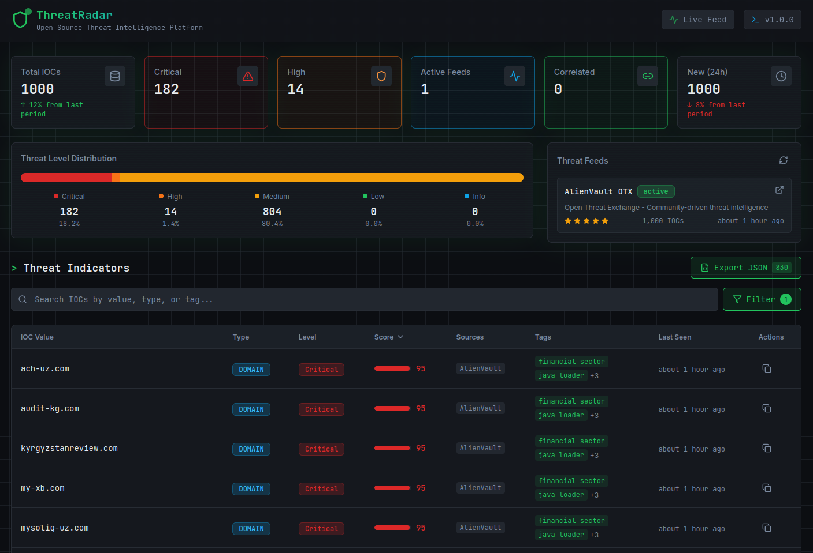
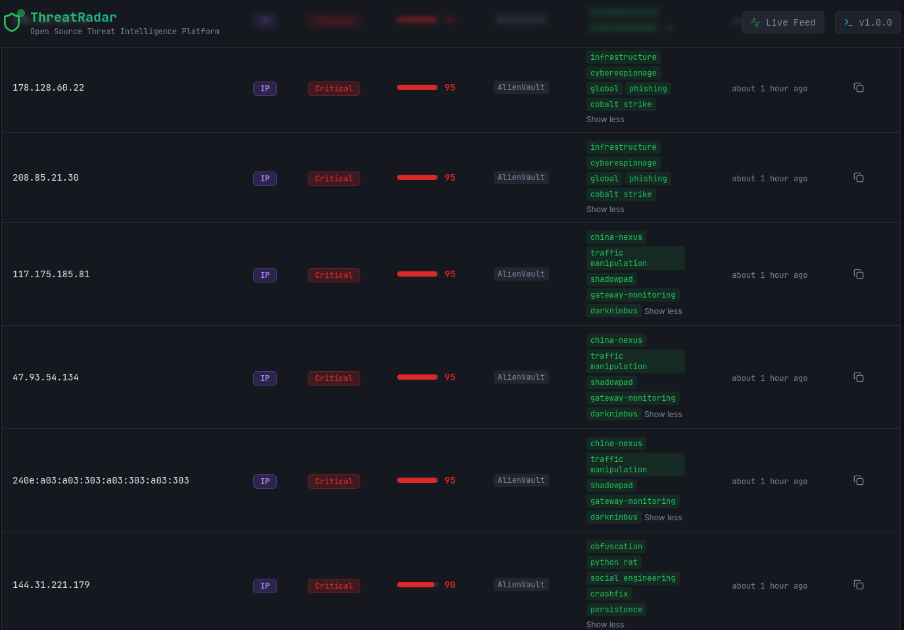

# 🛡️ ThreatRadar - Open Source Threat Intelligence Platform


**ThreatRadar** is a full-stack threat intelligence platform that aggregates Indicators of Compromise (IOCs) from public feeds, normalizes them, and presents them through a real-time cybersecurity dashboard.

The tool is suitable for:
* Security professionals monitoring threat landscapes
* SOC analysts performing threat detection and analysis
* Cybersecurity students learning threat intelligence concepts
* Researchers studying IOC patterns and attack trends

---

## 📸 Screenshots

<p align="center">
  
  <br/>
  <em>Screenshot 1</em>
</p>

<p align="center">
  
  <br/>
  <em>Screenshot 2</em>
</p>

---

## 📋 Table of Contents

- [📸 Screenshots](#-screenshots)
- [✨ Key Features](#-key-features)
- [🚀 Installation](#-installation)
- [🎮 Usage](#-usage)
- [📊 Modules](#-modules)
- [🔧 Configuration](#-configuration)
- [🔍 API Endpoints](#-api-endpoints)
- [🔐 Security Notes](#-security-notes)
- [📜 License](#-license)

---

## ✨ Key Features

### 📡 Threat Intelligence Aggregation
* Real-time IOC collection from **AlienVault OTX** community feed
* Automatic normalization and deduplication of indicators
* Support for IPs, domains, URLs, file hashes, and email addresses
* Tag-based threat classification with score-level correlation
* Fallback mock data for demonstration without API keys

### 📊 Interactive Dashboard
* Real-time statistics with threat level breakdown
* Threat level distribution chart
* Feed health monitoring
* Advanced filtering by IOC type, severity, and keyword search
* Auto-refresh with 60-second polling interval

### 📤 Data Export
* Export filtered IOCs to **CSV** format
* Export filtered IOCs to **JSON** format
* Full dataset or filtered subset export

### 🐳 Docker Deployment
* Single-command deployment with **Docker Compose**
* Pre-configured backend and frontend containers
* Health checks and automatic restart policies
* Volume-based persistent storage

---

## 🚀 Installation

### Prerequisites
* **Docker** and **Docker Compose** (recommended)
* OR: Python **3.11+** and Node.js **20+** (manual setup)
* Optional: AlienVault OTX API key for real threat data

### Option 1: Docker (Recommended)

```bash
# Clone the repository
git clone https://github.com/yourusername/threat-radar.git
cd threat-radar

# Configure environment
cp config/.env.example config/.env
# Edit config/.env and add your API key (optional)

# Start the application
docker-compose up -d # Use sudo if it crashes
```

### Option 2: Using the Startup Script

```bash
# Clone and navigate to project
git clone https://github.com/yourusername/threat-radar.git
cd threat-radar

# Run the startup script (checks dependencies, creates config, starts containers)
chmod +x start.sh
./start.sh
```

### Option 3: Manual Setup

**Backend:**

```bash
cd backend

# Create virtual environment
python -m venv venv
source venv/bin/activate

# Install dependencies
pip install -r requirements.txt

# Configure environment
cp ../config/.env.example .env

# Run the server
python -m uvicorn app.main:app --reload --port 8001
```

**Frontend:**

```bash
cd frontend

# Install dependencies
npm install

# Configure API URL
echo "VITE_API_URL=http://localhost:8001/api/v1" > .env

# Run development server
npm run dev
```

### Verify Installation

Once running, open http://localhost:5173 in your browser. You should see the ThreatRadar dashboard with threat statistics and IOC data.

**Note:** Without an API key, the system displays mock data for demonstration purposes. Add your AlienVault OTX key to `config/.env` for real threat intelligence.

---

## 🎮 Usage

### Access Points

Once launched, ThreatRadar is accessible at:

| Service | URL |
|---------|-----|
| Dashboard | http://localhost:5173 |
| API Docs (Swagger) | http://localhost:8001/docs |
| API Docs (ReDoc) | http://localhost:8001/redoc |
| API Endpoint | http://localhost:8001/api/v1 |

### Useful Commands

```bash
# View container logs
docker-compose logs -f

# Stop the application
docker-compose down

# Restart services
docker-compose restart

# Rebuild after code changes
docker-compose up -d --build

# View container status
docker-compose ps
```

---

## 📊 Modules

### 1. Dashboard Overview

The main dashboard displays:
* **Statistics Cards** - Total IOCs, critical/high counts, active feeds, correlated IOCs, new indicators (24h)
* **Threat Level Chart** - Visual distribution of IOC severity levels
* **Feed Status** - Health and update status of connected feeds

### 2. IOC Table

Browse and analyze collected indicators:
* Full-text search across all IOC values
* Filter by type (IP, domain, hash, URL, email)
* Filter by threat level (critical, high, medium, low, info)
* Expandable tags with click-to-expand functionality
* Score and threat level correlation

### 3. Export System

Export threat data for external analysis:
* **CSV Export** - Spreadsheet-compatible format
* **JSON Export** - Machine-readable structured data
* Exports respect active filters

### 4. REST API

Programmatic access to all threat intelligence data:
* Query indicators with filtering and pagination
* Retrieve feed metadata and health status
* Access aggregate statistics
* Trigger manual feed updates

---

## 🔧 Configuration

### Environment Variables

Create a `.env` file in the `config/` directory:

```bash
# Copy the example configuration
cp config/.env.example config/.env
```

Key settings in `config/.env`:

```bash
# AlienVault OTX API Key (optional - uses mock data if empty)
ALIENVAULT_OTX_API_KEY=your_key_here

# Feed update interval in seconds
FEED_UPDATE_INTERVAL=300

# Maximum IOCs per feed
MAX_IOCS_PER_FEED=1000

# Logging level
LOG_LEVEL=INFO
```

### Obtaining an API Key

The API key is optional. Without it, the system runs with mock data for demonstration.

**AlienVault OTX (Free):**
* Sign up at https://otx.alienvault.com/
* Navigate to Settings → API Integration
* Copy your OTX Key
* Paste it into `config/.env`

---

## 🔍 API Endpoints

### Get Indicators
```http
GET /api/v1/indicators?types=ip&levels=critical&limit=10
```

Query parameters: `search`, `types`, `levels`, `sources`, `limit`, `offset`

### Get Statistics
```http
GET /api/v1/statistics
```

Returns aggregate counts by threat level, active feeds, and correlation metrics.

### Get Feeds
```http
GET /api/v1/feeds
```

Returns metadata and health status of all configured feeds.

### Trigger Feed Update
```http
POST /api/v1/feeds/update
```

Triggers an immediate refresh of all feed data.

### Health Check
```http
GET /health
```

Returns service health status.

---

## 🔐 Security Notes

* **Defensive Use Only**: This tool is designed for threat monitoring and security research
* **API Key Safety**: Never commit your `.env` file with real API keys to version control
* **Rate Limits**: Respect AlienVault OTX API rate limits to avoid account suspension
* **Data Sensitivity**: IOC data may contain sensitive indicators - handle appropriately
* **Network Access**: The backend makes outbound API calls to AlienVault OTX servers

### Ethical Usage

ThreatRadar is intended for:
* Threat intelligence research and monitoring
* Educational purposes and cybersecurity learning
* Security operations and incident response
* Authorized security assessments

---

## 📜 License

This project is licensed under the **MIT License**.

**Author:** Ayoub Serarfi
